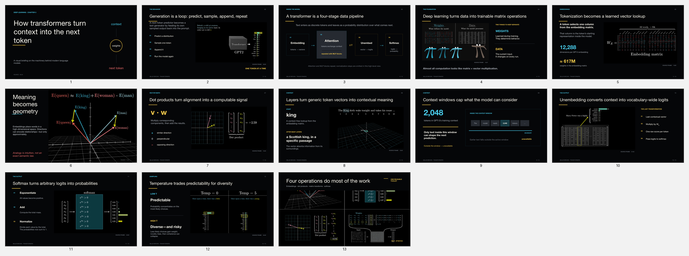

# video-to-slides

[](https://skills.sh/lostviolinist/video-to-slides)

Turn any YouTube video into a PowerPoint deck that you can flip through easily and quickly. The skill watches any video, identifies its most important points, and turns it into an informational PPT deck.

I made this skill for myself because I want to learn from the many YouTube videos out there, but I don't have the attention span to listen for an hour straight!

## What you get

- A `.pptx` deck on the most important points from the video, that you can edit and customise!
- A transcript with timestamps
- The most useful screenshots from the video
- Speaker notes showing where each slide came from
- Extra files that let you check the deck against the video
- Better-looking slides with Paper, if you want to use it

## Example output

Here is a sample made from [3Blue1Brown's *Transformers, the tech behind LLMs*](https://youtu.be/wjZofJX0v4M). I used Paper for the design.

[Download the editable sample deck](examples/wjZofJX0v4M/transformers-paper-redesign.pptx)



This is roughly what you can expect. The words, colors, and layout will change to match each video.

## Install

Open Terminal and paste this:

```bash
npx skills add lostviolinist/video-to-slides --skill video-to-slides -g -a codex -y
```

Then restart Codex. Paste this once to finish setting it up:

```bash
bash ~/.codex/skills/video-to-slides/scripts/setup.sh
```

## Use

Ask Codex naturally:

```text
Turn this video into slides: https://youtu.be/VIDEO_ID
```

You can also be more specific. For example:

```text
Show me the slide plan before you build it:
Turn this video into slides: https://youtu.be/VIDEO_ID --review-outline

Make it 10 slides:
Turn this video into slides: https://youtu.be/VIDEO_ID --slides 10

Use Paper for the design:
Turn this video into slides: https://youtu.be/VIDEO_ID --design paper
```

### Don't want to download the Whisper model? (Recommended!!)

That is fine for most YouTube videos with captions. By default, the skill checks the captions and uses them without downloading the large Whisper model.

Use `--transcription captions` if you never want it to use Whisper. If a video has no captions, the skill will stop and tell you instead of making slides from incomplete information.

Videos with no captions and videos stored on your computer still need Whisper or a transcript you provide. If you want the skill to use Whisper, just say so in your request.

The setup step adds a small helper for transcription, but it does not download the large Whisper model.

## Want better-looking slides? Paper is optional

Paper is a design app. The skill can use it to try out the colors, fonts, and layouts before making the editable PowerPoint. Much recommended if you don't want your deck to look like ChatGPT slop :p

Paper connects to Codex using something called MCP. You do not need to understand how it works—just set it up once:

1. [Install Paper Desktop](https://paper.design/downloads), sign in, and open any Paper file.
2. In Codex, open **Settings → MCP Servers**, add a **Streamable HTTP** server named `paper`, and use `http://127.0.0.1:29979/mcp` as the URL.
3. Save, restart Codex, and verify the connection by asking: “Create a red rectangle in Paper.”
4. Use `--design paper` when you make a deck.

If you do not install Paper, you do not need to change anything. The skill will still make the slides without it.

See [Paper's setup guide](https://paper.design/docs/mcp) if the connection is not working.

## How it chooses the look

The skill looks at the video's colors, fonts, diagrams, screenshots, and overall feel. It uses those clues to make a deck that fits the video instead of using the same template every time.

## How it avoids missing important parts

- It prefers good captions when they are available.
- If Whisper is already installed—or you approve it—the skill can use it to double-check parts of the captions.
- It goes through the whole video in smaller sections, including videos that are over an hour long.
- It looks for useful diagrams, charts, equations, code, demonstrations, and on-screen text.
- It keeps timestamps in the speaker notes so you can check each slide against the video.
- You are responsible for having permission to download and reuse the video.

## Every deck gets checked before you receive it

The skill runs two checks at the end of every deck:

- It checks that the whole video was reviewed, the important points made it into the slides, screenshots and diagrams are connected to the right evidence, and every slide has source notes.
- It looks through the finished slides and checks whether the chosen points, screenshots, and diagrams are actually right and useful.

If either check fails, the skill fixes the deck and runs the checks again before giving it to you. The results are saved with the other project files as `eval.json` and `semantic_eval.json`.

## Testing changes to the skill

If you edit the skill, you can check that everything still works by running:

```bash
bash tests/run_tests.sh
```

To run the same check yourself:

```bash
python scripts/video_to_slides.py eval --project /path/to/project --pptx /path/to/deck.pptx
```

The command saves its result as `eval.json`. Then use [the four-part review rubric](evals/rubric.md) for the visual check.

The skill is built for Mac. You do not need Homebrew.
